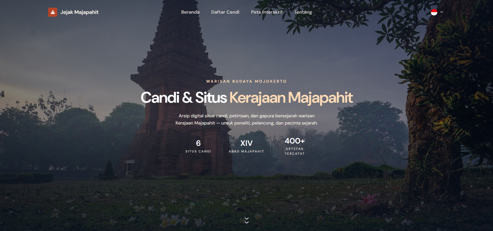

# **Jejak Majapahit**

<p align="justify">
Jejak Majapahit is a digital heritage website that introduces selected archaeological sites from the Majapahit Kingdom in Mojokerto, Indonesia. This project aims to provide an accessible and engaging way to explore historical landmarks through a clean, modern, and bilingual web experience.
</p>

## **Preview**



## **Design Philosophy**

<p align="justify">
The website embraces a *less is more* approach, prioritizing clarity, readability, and visual balance over excessive animations or decorative elements. Each section is intentionally designed to help visitors focus on historical content while maintaining a comfortable browsing experience across desktop and mobile devices.
</p>

## **Technology Stack**

* React
* Vite
* Tailwind CSS
* JavaScript
* Google Maps Embed

## **Language Support**

* 🇮🇩 Bahasa Indonesia
* 🇬🇧 English

## **Getting Started**

Clone this repository and install the required dependencies.

```bash
git clone https://github.com/your-username/jejak-majapahit.git
cd jejak-majapahit
npm install
npm run dev
```

## **License** 
This project is intended for educational and portfolio purposes.